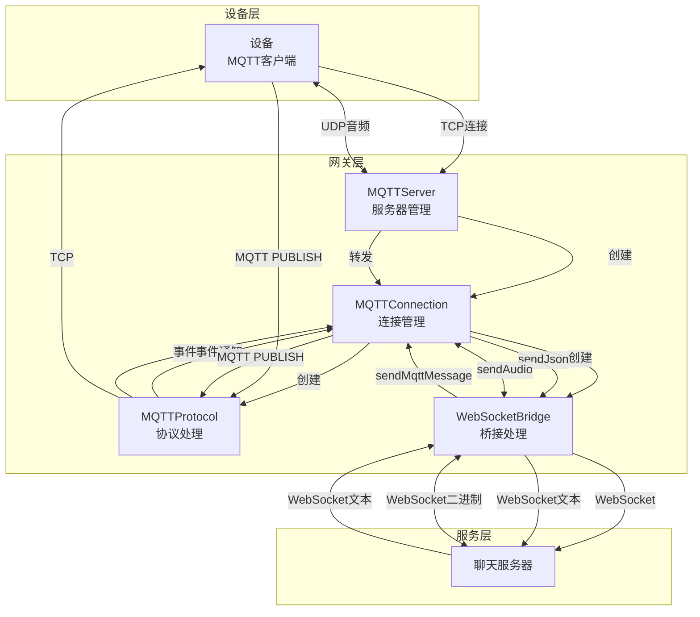
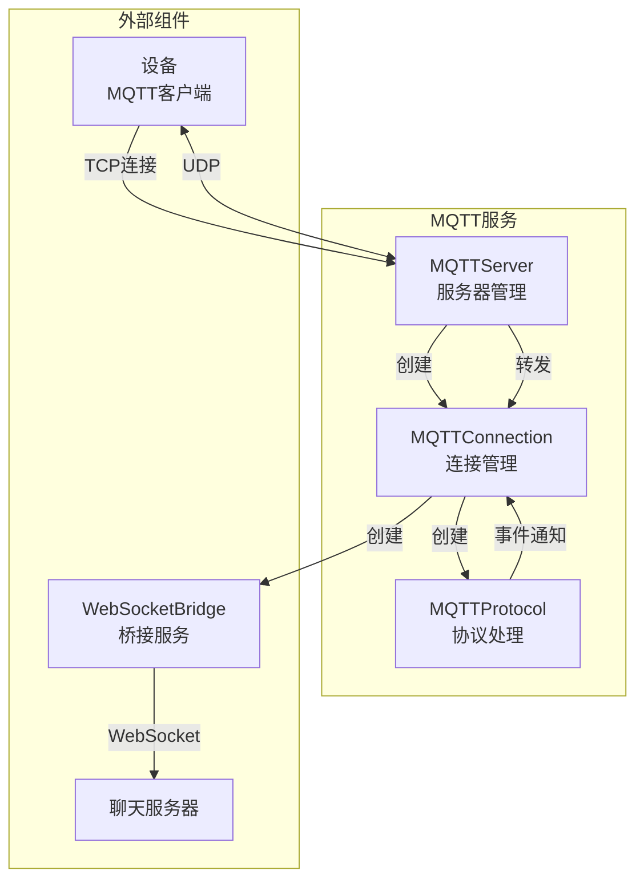
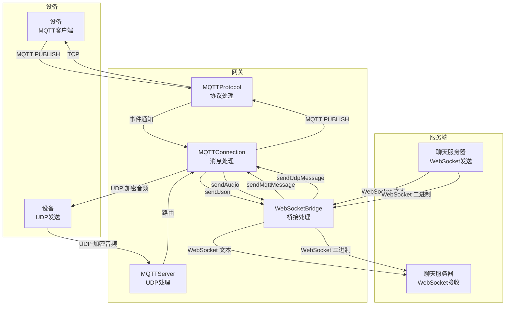

# XiaoZhi MQTT Gateway 技术文档

## 1. 项目概述

XiaoZhi MQTT Gateway 是一个用于连接 MQTT 设备和后端服务的网关系统，主要功能包括：

- 设备认证与管理
- MQTT 协议处理
- 音频数据传输
- WebSocket 桥接
- 多协议融合

该网关系统实现了设备与服务端之间的双向通信，支持实时音频传输和可靠的控制消息传递。

## 2. 系统架构

### 2.1 整体架构



### 2.2 核心组件

| 组件 | 职责 | 文件位置 |
|------|------|----------|
| MQTTServer | 服务器管理，连接池，UDP 服务 | app.js |
| MQTTConnection | 单个连接的应用层逻辑 | app.js |
| MQTTProtocol | MQTT 协议解析和封装 | mqtt-protocol.js |
| WebSocketBridge | 与服务端的 WebSocket 通信 | app.js |
| ConfigManager | 配置管理 | utils/config-manager.js |

### 2.3 组件交互关系



## 3. MQTT 认证机制

### 3.1 认证流程

1. **设备连接请求**：
   - 设备发送 `CONNECT` 消息，包含 `clientId`、`username` 和 `password`
   - `clientId` 格式为 `GID_test@@@mac_address@@@uuid` 或 `GID_test@@@mac_address`

2. **服务器认证处理**：
   - 在 `MQTTConnection.handleConnect()` 方法中解析连接参数
   - 调用 `validateMqttCredentials()` 函数验证客户端凭证
   - 验证通过后发送 `CONNACK` 消息，标记连接成功

3. **客户端 ID 格式解析**：
   - `GID_test@@@mac_address@@@uuid`：完整格式，包含组 ID、MAC 地址和 UUID
   - `GID_test@@@mac_address`：简化格式，包含组 ID 和 MAC 地址
   - 解析出的 MAC 地址会进行正则验证，确保格式正确

### 3.2 认证代码实现

```javascript
// 客户端连接处理
handleConnect(connectData) {
    this.clientId = connectData.clientId;
    this.username = connectData.username;
    this.password = connectData.password;
    
    const parts = this.clientId.split('@@@');
    if (parts.length === 3) { // GID_test@@@mac_address@@@uuid
        const validated = validateMqttCredentials(this.clientId, this.username, this.password);
        this.groupId = validated.groupId;
        this.macAddress = validated.macAddress;
        this.uuid = validated.uuid;
        this.userData = validated.userData;
    } else if (parts.length === 2) { // GID_test@@@mac_address
        this.groupId = parts[0];
        this.macAddress = parts[1].replace(/_/g, ':');
        if (!MacAddressRegex.test(this.macAddress)) {
            debug('无效的 macAddress:', this.macAddress);
            this.close();
            return;
        }
    } else {
        debug('无效的 clientId:', this.clientId);
        this.close();
        return;
    }
    this.replyTo = `devices/p2p/${parts[1]}`;
    
    this.server.addConnection(this);
    this.initializeDeviceTools();
}
```

## 4. 数据传输流程

### 4.1 消息路由机制

1. **主题格式**：设备订阅 `devices/p2p/{macAddress}` 主题
2. **消息路由**：网关通过主题将消息定向到特定设备
3. **回复主题设置**：

```javascript
// 设置回复主题
this.replyTo = `devices/p2p/${parts[1]}`; // parts[1] 是 MAC 地址

// 发送消息到指定主题
sendMqttMessage(payload) {
    debug(`发送消息到 ${this.replyTo}: ${payload}`);
    this.protocol.sendPublish(this.replyTo, payload, 0, false, false);
}
```

### 4.2 数据传输路径

- **控制消息**：设备 → MQTT → 网关 → WebSocket → 服务端
- **音频数据**：设备 → UDP（加密）→ 网关 → WebSocket → 服务端
- **响应消息**：服务端 → WebSocket → 网关 → MQTT → 设备
- **音频数据**：服务端 → WebSocket → 网关 → UDP（加密）→ 设备

### 4.3 连接管理

```javascript
// 服务器维护连接映射
this.connections = new Map(); // connectionId -> MQTTConnection

// 添加连接时检查重复
addConnection(connection) {
    // 检查是否已存在相同 clientId 的连接
    for (const [key, value] of this.connections.entries()) {
        if (value.clientId === connection.clientId) {
            debug(`${connection.clientId} 已存在连接，关闭旧连接`);
            value.close();
        }
    }
    this.connections.set(connection.connectionId, connection);
}
```

### 4.4 WebSocket 到服务端的数据传输

#### 4.4.1 WebSocket 桥接实现

```javascript
class WebSocketBridge extends Emitter {
    constructor(connection, protocolVersion, macAddress, uuid, userData) {
        super();
        this.connection = connection;
        this.macAddress = macAddress;
        this.uuid = uuid;
        this.userData = userData;
        this.wsClient = null;
        this.protocolVersion = protocolVersion;
        this.deviceSaidGoodbye = false;
        this.initializeChatServer();
    }

    initializeChatServer() {
        const devMacAddresss = configManager.get('development')?.mac_addresss || [];
        let chatServers;
        if (devMacAddresss.includes(this.macAddress)) {
            chatServers = configManager.get('development')?.chat_servers;
        } else {
            chatServers = configManager.get('production')?.chat_servers;
        }
        if (!chatServers) {
            throw new Error(`未找到 ${this.macAddress} 的聊天服务器`);
        }
        this.chatServer = chatServers[Math.floor(Math.random() * chatServers.length)];
    }
}
```

#### 4.4.2 WebSocket 连接建立

```javascript
async connect(audio_params, features) {
    return new Promise((resolve, reject) => {
        const headers = {
            'device-id': this.macAddress,
            'protocol-version': '2',
            'authorization': `Bearer test-token`
        };
        if (this.uuid) {
            headers['client-id'] = this.uuid;
        }
        if (this.userData && this.userData.ip) {
            headers['x-forwarded-for'] = this.userData.ip;
        } 
        this.wsClient = new WebSocket(this.chatServer, { headers });

        this.wsClient.on('open', () => {
            this.sendJson({
                type: 'hello',
                version: 2,
                transport: 'websocket',
                audio_params,
                features
            });
        });

        this.wsClient.on('message', (data, isBinary) => {
            if (isBinary) {
                const timestamp = data.readUInt32BE(8);
                const opusLength = data.readUInt32BE(12);
                const opus = data.subarray(16, 16 + opusLength);
                // 二进制数据通过UDP发送
                this.connection.sendUdpMessage(opus, timestamp);
            } else {
                // JSON数据通过MQTT发送
                const message = JSON.parse(data.toString());
                if (message.type === 'hello') {
                    resolve(message);
                } else if (message.type === 'mcp' && 
                    this.connection.mcpCachedTools &&
                    ['initialize','notifications/initialized', 'tools/list'].includes(message.payload.method)) {
                    this.connection.onMcpMessageFromBridge(message);
                } else {
                    this.connection.sendMqttMessage(JSON.stringify(message));
                }
            }
        });

        this.wsClient.on('error', (error) => {
            console.error(`WebSocket error for device ${this.macAddress}:`, error);
            this.emit('close');
            reject(error);
        });

        this.wsClient.on('close', () => {
            this.emit('close');
        });
    });
}
```

#### 4.4.3 JSON 消息传输

**从设备到服务端**：
1. 设备发送 MQTT PUBLISH 消息，包含 JSON 数据
2. `MQTTConnection.handlePublish()` 解析 JSON 数据
3. `MQTTConnection.parseOtherMessage()` 处理消息
4. `WebSocketBridge.sendJson()` 将 JSON 消息通过 WebSocket 发送到服务端

```javascript
sendJson(message) {
    if (this.wsClient && this.wsClient.readyState === WebSocket.OPEN) {
        this.wsClient.send(JSON.stringify(message));
    }
}
```

**从服务端到设备**：
1. WebSocket 接收服务端的 JSON 消息
2. `WebSocketBridge` 的 `on('message')` 事件处理器接收消息
3. 非二进制消息通过 `this.connection.sendMqttMessage()` 发送到设备

#### 4.4.4 音频数据传输

**从设备到服务端**：
1. 设备通过 UDP 发送加密音频数据
2. `MQTTServer.onUdpMessage()` 接收 UDP 消息并路由到对应连接
3. `MQTTConnection.onUdpMessage()` 解密音频数据
4. `WebSocketBridge.sendAudio()` 将音频数据通过 WebSocket 发送到服务端

```javascript
sendAudio(opus, timestamp) {
    if (this.wsClient && this.wsClient.readyState === WebSocket.OPEN) {
        const buffer = Buffer.alloc(16 + opus.length);
        buffer.writeUInt32BE(timestamp, 8);
        buffer.writeUInt32BE(opus.length, 12);
        buffer.set(opus, 16);
        this.wsClient.send(buffer, { binary: true });
    }
}
```

**从服务端到设备**：
1. WebSocket 接收服务端的二进制音频数据
2. `WebSocketBridge` 的 `on('message')` 事件处理器接收二进制数据
3. 解析二进制数据，提取时间戳和音频数据
4. 通过 `this.connection.sendUdpMessage()` 将音频数据通过 UDP 发送到设备

#### 4.4.5 WebSocket 数据传输流程图



### 4.5 MQTT 服务与网关交互

#### 4.5.1 MQTT 服务启动

```javascript
class MQTTServer {
    constructor() {
        this.mqttPort = parseInt(process.env.MQTT_PORT) || 1883;
        this.udpPort = parseInt(process.env.UDP_PORT) || this.mqttPort;
        this.publicIp = process.env.PUBLIC_IP || 'mqtt.xiaozhi.me';
        this.connections = new Map(); // clientId -> MQTTConnection
        // ...
    }

    start() {
        this.mqttServer = net.createServer((socket) => {
            const connectionId = this.generateNewConnectionId();
            debug(`新客户端连接: ${connectionId}`);
            new MQTTConnection(socket, connectionId, this);
        });

        this.mqttServer.listen(this.mqttPort, () => {
            console.warn(`MQTT 服务器正在监听端口 ${this.mqttPort}`);
        });

        this.udpServer = dgram.createSocket('udp4');
        this.udpServer.on('message', this.onUdpMessage.bind(this));
        // ...
    }
}
```

#### 4.5.2 MQTT 连接处理

```javascript
class MQTTConnection {
    constructor(socket, connectionId, server) {
        this.server = server;
        this.connectionId = connectionId;
        // ...
        
        // 创建协议处理器，并传入socket
        this.protocol = new MQTTProtocol(socket, configManager);
        
        this.setupProtocolHandlers();
    }

    setupProtocolHandlers() {
        // 设置协议事件处理
        this.protocol.on('connect', (connectData) => {
            this.handleConnect(connectData);
        });

        this.protocol.on('publish', (publishData) => {
            this.handlePublish(publishData);
        });
        // ...
    }
}
```

#### 4.5.3 协议消息处理

```javascript
handlePublish(publishData) {
    debug('收到发布消息:', { 
        clientId: this.clientId, 
        topic: publishData.topic, 
        payload: publishData.payload, 
        qos: publishData.qos
    });
    
    if (publishData.qos !== 0) {
        debug('不支持的 QoS 级别:', publishData.qos, '关闭连接');
        this.close();
        return;
    }

    const json = JSON.parse(publishData.payload);
    if (json.type === 'hello') {
        if (json.version !== 3) {
            debug('不支持的协议版本:', json.version, '关闭连接');
            this.close();
            return;
        }
        this.parseHelloMessage(json).catch(error => {
            debug('处理 hello 消息失败:', error);
            this.close();
        });
    } else {
        this.parseOtherMessage(json).catch(error => {
            debug('处理其他消息失败:', error);
            this.close();
        });
    }
}
```

#### 4.5.4 WebSocket 桥接

```javascript
async parseHelloMessage(json) {
    this.udp = {
        ...this.udp,
        key: crypto.randomBytes(16),
        nonce: this.generateUdpHeader(0, 0, 0),
        encryption: 'aes-128-ctr',
        remoteSequence: 0,
        localSequence: 0,
        startTime: Date.now()
    }

    if (this.bridge) {
        debug(`${this.clientId} 收到重复 hello 消息，关闭之前的 bridge`);
        this.bridge.close();
        await new Promise(resolve => setTimeout(resolve, 100));
    }
    this.bridge = new WebSocketBridge(this, json.version, this.macAddress, this.uuid, this.userData);
    // ...
}
```

## 5. 协议格式分析

### 5.1 MQTT 协议消息格式

#### 固定头部格式

```
+-----------------------------------------------+
| 消息类型 (4位) | 标志位 (4位) | 剩余长度 (1-4字节) |
+-----------------------------------------------+
```

#### CONNECT 消息格式

```
+-----------------------------------------------+
| 固定头部 | 协议名长度 (2字节) | 协议名 | 协议级别 |
+-----------------------------------------------+
| 连接标志 | 保持连接时间 (2字节) | Client ID 长度 | Client ID |
+-----------------------------------------------+
| Username 长度 (可选) | Username (可选) |
+-----------------------------------------------+
| Password 长度 (可选) | Password (可选) |
+-----------------------------------------------+
```

#### PUBLISH 消息格式

```
+-----------------------------------------------+
| 固定头部 | 主题长度 (2字节) | 主题 |
+-----------------------------------------------+
| 包ID (2字节，QoS>0时) | 有效载荷 |
+-----------------------------------------------+
```

#### MQTT 消息类型

| 类型值 | 消息类型 | 说明 |
|--------|----------|------|
| 1 | CONNECT | 客户端连接请求 |
| 2 | CONNACK | 连接确认 |
| 3 | PUBLISH | 发布消息 |
| 8 | SUBSCRIBE | 订阅主题 |
| 9 | SUBACK | 订阅确认 |
| 12 | PINGREQ | 心跳请求 |
| 13 | PINGRESP | 心跳响应 |
| 14 | DISCONNECT | 断开连接 |

### 5.2 应用层 JSON 消息格式

#### Hello 消息

**设备发送**：
```json
{
  "type": "hello",
  "version": 3,
  "audio_params": {
    "codec": "opus",
    "sample_rate": 16000,
    "channels": 1,
    "bitrate": 24000
  },
  "features": ["voice", "text"]
}
```

**网关响应**：
```json
{
  "type": "hello",
  "version": 3,
  "session_id": "session_123456",
  "transport": "udp",
  "udp": {
    "server": "mqtt.xiaozhi.me",
    "port": 1883,
    "encryption": "aes-128-ctr",
    "key": "hex_encoded_key",
    "nonce": "hex_encoded_nonce"
  },
  "audio_params": {
    "codec": "opus",
    "sample_rate": 16000,
    "channels": 1,
    "bitrate": 24000
  }
}
```

#### Goodbye 消息

```json
{
  "type": "goodbye",
  "session_id": "session_123456"
}
```

#### MCP 消息

```json
{
  "type": "mcp",
  "payload": {
    "jsonrpc": "2.0",
    "method": "tools/list",
    "id": 10001,
    "params": {
      "cursor": "next_cursor"
    }
  }
}
```

#### 错误消息

```json
{
  "type": "error",
  "message": "处理 hello 消息失败"
}
```

### 5.3 UDP 音频数据格式

#### UDP 消息头部

```
+----------------+----------------+----------------+----------------+
| 类型 (1字节) | 标志 (1字节) |  payload长度 (2字节) | 连接ID (4字节) |
+----------------+----------------+----------------+----------------+
|          时间戳 (4字节)          |        序列号 (4字节)        |
+----------------------------------+------------------------------+
```

#### UDP 消息数据部分

```
+----------------+----------------+
|     头部 (16字节)     | 加密音频数据 |
+----------------+----------------+
```

#### UDP 消息处理

```javascript
onUdpMessage(message, rinfo) {
    if (!this.bridge) {
        return;
    }
    if (this.udp.remoteAddress !== rinfo) {
        this.udp.remoteAddress = rinfo;
    }
    if (sequence < this.udp.remoteSequence) {
        return;
    }

    // 处理加密数据
    const header = message.slice(0, 16);
    const encryptedPayload = message.slice(16, 16 + payloadLength);
    const cipher = crypto.createDecipheriv(this.udp.encryption, this.udp.key, header);
    const payload = Buffer.concat([cipher.update(encryptedPayload), cipher.final()]);
    
    this.bridge.sendAudio(payload, timestamp);
    this.udp.remoteSequence = sequence;
}
```

### 5.4 WebSocket 消息格式

#### JSON 消息

与应用层 JSON 消息格式相同，通过 WebSocket 文本帧传输。

#### 二进制消息（音频数据）

```
+----------------+----------------+----------------+----------------+
| 预留 (8字节) | 时间戳 (4字节) | 音频长度 (4字节) |    Opus音频数据   |
+----------------+----------------+----------------+----------------+
```

#### WebSocket 消息处理

```javascript
this.wsClient.on('message', (data, isBinary) => {
    if (isBinary) {
        const timestamp = data.readUInt32BE(8);
        const opusLength = data.readUInt32BE(12);
        const opus = data.subarray(16, 16 + opusLength);
        // 二进制数据通过UDP发送
        this.connection.sendUdpMessage(opus, timestamp);
    } else {
        // JSON数据通过MQTT发送
        const message = JSON.parse(data.toString());
        if (message.type === 'hello') {
            resolve(message);
        } else if (message.type === 'mcp' && 
            this.connection.mcpCachedTools &&
            ['initialize','notifications/initialized', 'tools/list'].includes(message.payload.method)) {
            this.connection.onMcpMessageFromBridge(message);
        } else {
            this.connection.sendMqttMessage(JSON.stringify(message));
        }
    }
});
```

## 6. 安全机制

### 6.1 数据加密

- **UDP 音频加密**：使用 AES-128-CTR 加密
- **密钥生成**：网关为每个连接生成随机 16 字节密钥
- **IV (初始化向量)**：使用 UDP 消息头部作为 IV

### 6.2 认证机制

- **MQTT 认证**：使用 `validateMqttCredentials()` 验证客户端凭证
- **WebSocket 认证**：使用 Bearer 令牌认证
- **设备标识**：使用 MAC 地址作为设备的唯一标识

### 6.3 连接安全

- **心跳检测**：定期检查设备连接状态
- **连接超时**：超过心跳间隔自动关闭连接
- **重连处理**：处理设备重连，确保消息不丢失

## 7. 协议扩展方案

### 7.1 MQTT 协议扩展

1. **添加新的消息类型**：在 `PacketType` 枚举中添加新的消息类型
2. **扩展现有消息处理**：在 `processBuffer` 方法中添加新消息类型的处理
3. **实现相应的解析和发送方法**

### 7.2 应用层协议扩展

1. **添加新的消息类型**：在 `handlePublish` 方法中添加新的消息类型处理
2. **实现相应的消息解析和处理逻辑**
3. **更新 WebSocket 桥接逻辑以支持新消息类型**

### 7.3 传输层扩展

1. **添加新的传输协议支持**：如 WebRTC、TCP 等
2. **实现相应的连接和数据传输逻辑**
3. **更新协议协商逻辑以支持新传输方式**

## 8. 代码优化建议

### 8.1 性能优化

1. **缓冲区管理**：优化缓冲区使用，减少内存分配
2. **连接管理**：实现连接池，减少连接创建和销毁的开销
3. **加密优化**：使用更高效的加密算法和密钥管理

### 8.2 可靠性优化

1. **错误处理**：完善错误处理机制，提高系统稳定性
2. **重试机制**：实现消息重试机制，确保消息可靠传输
3. **监控系统**：添加连接状态和消息传输的监控

### 8.3 安全性优化

1. **认证增强**：使用更安全的认证机制，如 OAuth 2.0
2. **加密增强**：使用更强的加密算法和密钥管理
3. **安全审计**：添加安全审计日志，监控异常行为

## 9. 总结

XiaoZhi MQTT Gateway 是一个功能完整、架构清晰的网关系统，实现了设备与服务端之间的双向通信。该系统具有以下特点：

1. **多协议融合**：MQTT 用于控制消息，UDP 用于音频数据，WebSocket 用于网关与服务端通信
2. **设备认证**：使用 clientId 和凭证验证确保设备合法性
3. **数据安全**：UDP 音频数据使用 AES-128-CTR 加密
4. **实时传输**：UDP 协议保证音频数据的低延迟传输
5. **可靠传输**：MQTT 协议保证控制消息的可靠传输
6. **可扩展性**：模块化设计便于功能扩展和协议升级

该系统架构设计合理，代码实现规范，适合作为智能设备通信的网关解决方案。通过不断优化和扩展，可以支持更多的设备类型和应用场景。

## 10. 技术特点总结

### 10.1 架构设计特点

1. **多层架构**：
   - 网络层：TCP 连接和 UDP 数据传输
   - 协议层：MQTT 协议解析和封装
   - 应用层：业务逻辑处理和消息路由
   - 桥接层：与聊天服务器的 WebSocket 通信

2. **事件驱动**：
   - `MQTTProtocol` 通过事件通知 `MQTTConnection`
   - `MQTTConnection` 处理业务逻辑并与 `WebSocketBridge` 交互
   - `WebSocketBridge` 通过事件通知连接状态变化

3. **模块化设计**：
   - 清晰的职责分离，便于维护和扩展
   - 组件化架构，支持功能的独立升级

### 10.2 多协议协同

1. **协议选择**：
   - MQTT：控制消息的可靠传输
   - UDP：音频数据的实时传输
   - WebSocket：网关与服务端的双向通信

2. **协议转换**：
   - MQTT 消息 ↔ WebSocket 文本消息
   - UDP 加密音频 ↔ WebSocket 二进制消息
   - 实现了协议之间的无缝转换

3. **实时性与可靠性平衡**：
   - UDP 保证音频数据的实时传输
   - MQTT 保证控制消息的可靠传输

### 10.3 安全机制

1. **多层认证**：
   - MQTT 认证：`validateMqttCredentials()`
   - WebSocket 认证：Bearer 令牌
   - 设备标识：使用 MAC 地址作为设备的唯一标识

2. **数据加密**：
   - UDP 音频数据使用 AES-128-CTR 加密
   - 为每个连接生成随机密钥
   - 使用消息头部作为初始化向量

3. **连接安全**：
   - 心跳检测：定期检查设备连接状态
   - 连接超时：超过心跳间隔自动关闭连接
   - 重连处理：处理设备重连，确保消息不丢失

### 10.4 连接管理

1. **连接池**：
   - `MQTTServer` 维护所有设备连接
   - 使用 Map 数据结构存储连接信息
   - 支持连接的快速查找和路由

2. **心跳机制**：
   - 定期检查所有连接的心跳状态
   - 超时连接自动关闭
   - 实时监控连接状态

3. **资源管理**：
   - 及时清理断开的连接
   - 释放相关资源
   - 防止内存泄漏

### 10.5 消息路由

1. **主题路由**：
   - 使用 `devices/p2p/{macAddress}` 主题格式
   - 通过主题将消息定向到特定设备
   - 支持点对点消息传输

2. **连接 ID 路由**：
   - UDP 消息使用连接 ID 进行路由
   - 快速定位目标连接
   - 提高路由效率

3. **消息过滤**：
   - 根据消息类型进行不同处理
   - 支持 MCP 消息的特殊处理
   - 灵活的消息分发机制

### 10.6 性能优化

1. **缓冲区管理**：
   - 预分配缓冲区，减少内存分配
   - 重用缓冲区，提高性能
   - 优化内存使用

2. **连接复用**：
   - WebSocket 连接复用，减少连接建立开销
   - 支持多消息复用同一连接
   - 提高资源利用率

3. **异步处理**：
   - 使用 Promise 和 async/await 处理异步操作
   - 避免阻塞主线程
   - 提高并发处理能力

## 11. 应用场景

### 11.1 智能家居

- 设备连接：智能音箱、智能家电等
- 语音交互：实时语音识别和响应
- 设备控制：远程控制和状态查询

### 11.2 物联网

- 传感器网络：环境监测、设备监控
- 数据采集：实时数据传输和处理
- 远程管理：设备远程配置和控制

### 11.3 车联网

- 车载设备：车载信息娱乐系统
- 语音助手：车载语音交互
- 远程服务：车辆远程诊断和控制

### 11.4 工业控制

- 工业设备：设备监控和控制
- 数据采集：实时数据传输
- 远程运维：设备远程维护

## 12. 未来发展方向

### 12.1 功能扩展

1. **协议扩展**：
   - 支持 MQTT 5.0 协议
   - 添加新的消息类型
   - 支持更多传输协议

2. **功能增强**：
   - 支持文件传输
   - 添加设备管理功能
   - 支持设备组管理

### 12.2 性能优化

1. **性能提升**：
   - 优化加密算法
   - 改进缓冲区管理
   - 提高并发处理能力

2. **资源优化**：
   - 减少内存占用
   - 优化网络带宽使用
   - 提高资源利用率

### 12.3 安全增强

1. **安全升级**：
   - 使用更强的加密算法
   - 实现更安全的认证机制
   - 添加安全审计功能

2. **防护增强**：
   - 防止 DDoS 攻击
   - 防止消息篡改
   - 提高系统安全性

### 12.4 可观测性

1. **监控增强**：
   - 添加详细的监控指标
   - 实现实时监控
   - 支持性能分析

2. **日志增强**：
   - 完善日志记录
   - 支持日志分析
   - 实现日志追踪

## 13. 部署建议

### 13.1 环境要求

- Node.js 版本：14.x 或更高
- 操作系统：Linux、Windows、macOS
- 网络环境：稳定的网络连接
- 硬件要求：根据并发连接数确定

### 13.2 配置建议

- 根据实际需求调整端口配置
- 根据网络环境调整心跳间隔
- 根据安全要求调整加密参数
- 根据性能需求调整缓冲区大小

### 13.3 部署方式

- 单机部署：适合小规模应用
- 集群部署：适合大规模应用
- 容器化部署：便于管理和扩展
- 云服务部署：便于弹性扩展

### 13.4 监控运维

- 监控连接状态
- 监控消息传输
- 监控系统性能
- 及时处理异常情况

## 14. 结论

XiaoZhi MQTT Gateway 是一个设计精良、实现规范的网关系统，通过多协议融合实现了设备与服务端之间的高效通信。系统架构清晰，模块化设计合理，代码实现规范，具有良好的可扩展性和可维护性。

通过不断优化和扩展，该系统可以支持更多的设备类型和应用场景，为智能设备通信提供强大的技术支撑。该系统适合作为智能家居、物联网、车联网、工业控制等领域的网关解决方案。
